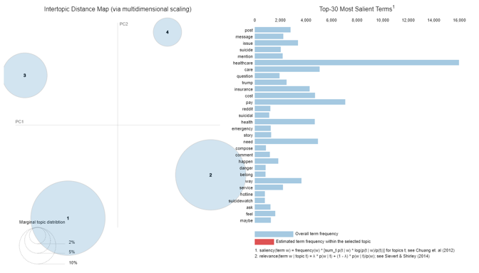
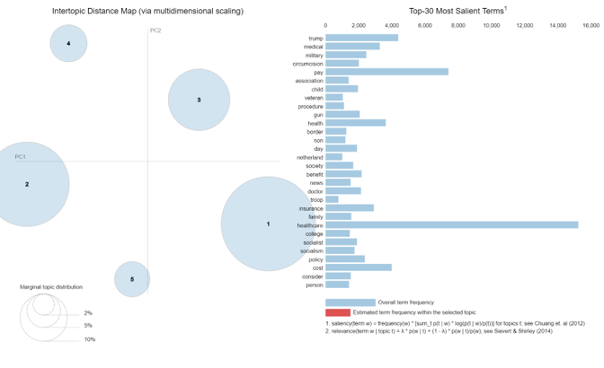
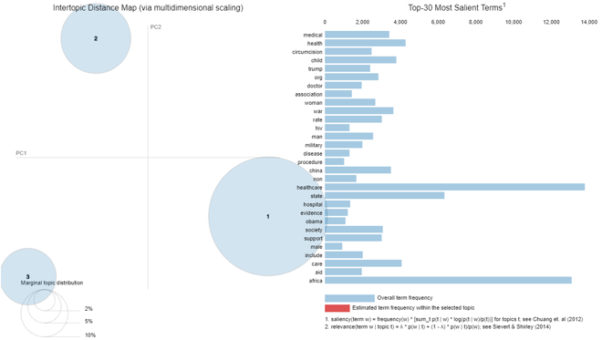

# Healthcare-Across-Countries-Text-Analytics

This project is a part of the coursework for Text Analytics. Here we scraped data from various websites to understand the major differences in healthcare systems across 3 countries.

## Table of contents
- [Business Problem](https://github.com/anshikaahuja/Healthcare-Across-Countries-Text-Analytics/blob/master/README.md#business-problem)
- [Data Used](https://github.com/anshikaahuja/Healthcare-Across-Countries-Text-Analytics/blob/master/README.md#data-used)
- [Approach](https://github.com/anshikaahuja/Healthcare-Across-Countries-Text-Analytics/blob/master/README.md#approach)
- [Algorithms/Libraries Used](https://github.com/anshikaahuja/Healthcare-Across-Countries-Text-Analytics/blob/master/README.md#algorithmslibraries-used)
- [Results](https://github.com/anshikaahuja/Healthcare-Across-Countries-Text-Analytics/blob/master/README.md#results)

## Business Problem

## Data Used
We scraped data from various blogs to understand the expert opinion, from various news websites to understand what topics are being discussed in the news and from websites like Quora and Reddit to understand the public opionion.

## Approach

## Algorithms/Libraries Used
- Scikit-learn and gensim.
- Scit-kit gives more flexibility in terms of fine tuning the parameters
- Word pre-processing - Stopwords removal and lemmatization
- LDA modelling - hypertuned the parameters (number of topics, iterations etc) via sklearn Gridsearch
- Topic modelling was done on user opinions from three geographies with different healthcare standards - US, Europe and Africa
- Visualization was done with pyLDAvis library
- Unsupervised Extractive Summarization - Tokenize and vector each sentence and performed cosine similarity

## Results

**1. Healthcare Expenditure across countries**

**2. Topic Modelling**  

**US** 
  
**Europe** 
  
**Africa** 

**3. Themes**

**US** 
  
**Europe** 
  
**Africa** 
  
