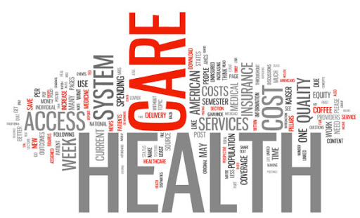
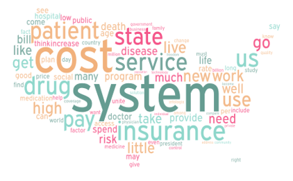
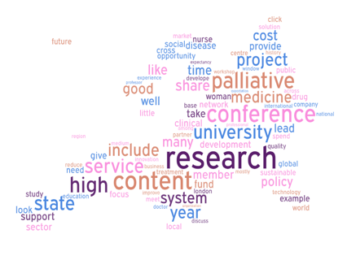
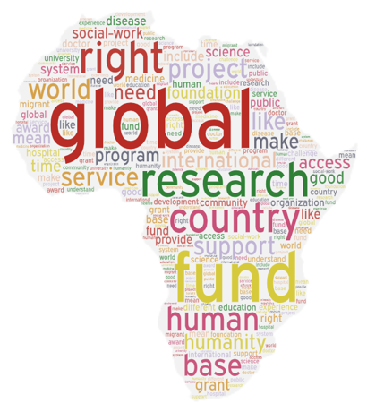
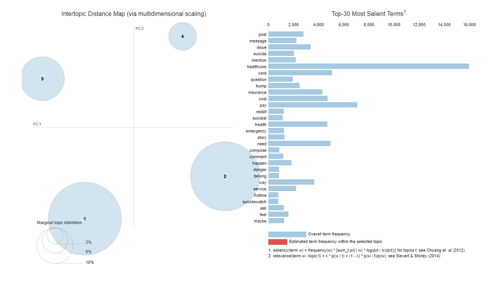
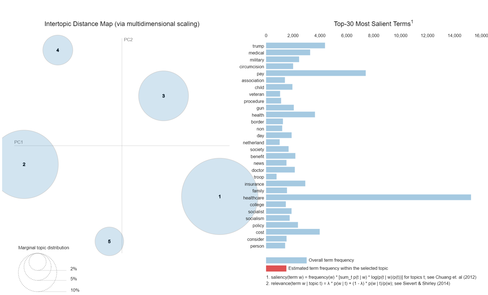
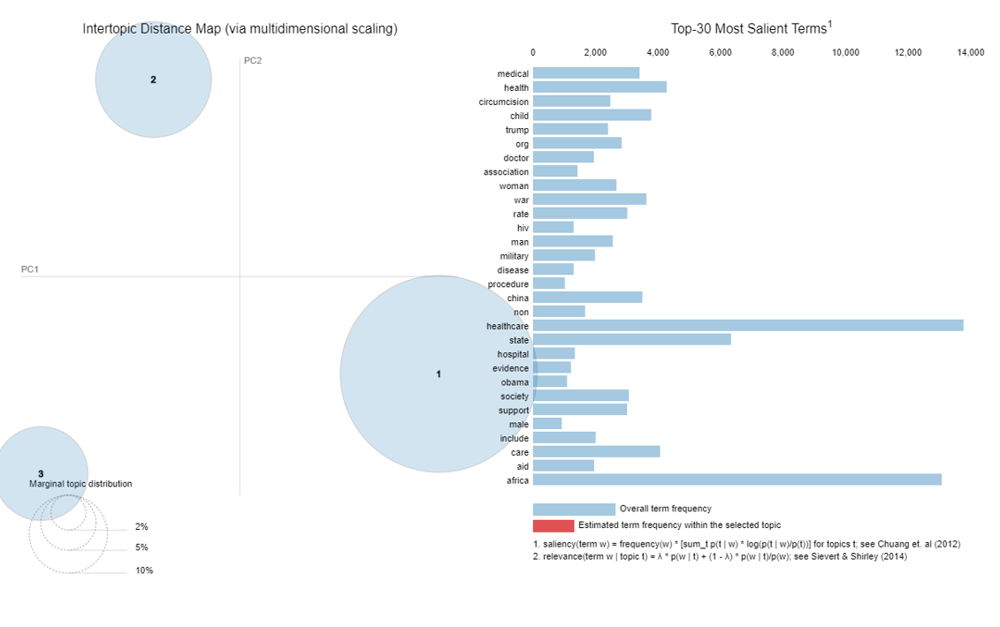

# Healthcare-Across-Countries-Text-Analytics

This project is a part of the coursework for Text Analytics. Here we scraped data from various websites to understand the major differences in healthcare systems across 3 countries.

## Table of contents
- [Business Problem](https://github.com/anshikaahuja/Healthcare-Across-Countries-Text-Analytics/blob/master/README.md#business-problem)
- [Data Used](https://github.com/anshikaahuja/Healthcare-Across-Countries-Text-Analytics/blob/master/README.md#data-used)
- [Approach](https://github.com/anshikaahuja/Healthcare-Across-Countries-Text-Analytics/blob/master/README.md#approach)
- [Algorithms/Libraries Used](https://github.com/anshikaahuja/Healthcare-Across-Countries-Text-Analytics/blob/master/README.md#algorithmslibraries-used)
- [Results](https://github.com/anshikaahuja/Healthcare-Across-Countries-Text-Analytics/blob/master/README.md#results)

## Business Problem
Healthcare systems differ widely across various countries. Across the globe, health care policymakers face mounting pressure to lower costs while improving the quality and safety of care. Countries need analyze the sentiment

## Data Used
We scraped data from various blogs to understand the expert opinion, from various news websites to understand what topics are being discussed in the news and from websites like Quora and Reddit to understand the public opionion.

## Approach
1. Scrape Data from multiple platforms across Africa, Europe and America to understand the different opinions that people have about their countries healthcare systems. Here we scraped data from blogs written by healthcare experts to analyze the vital links in the healthcare chain according to the experts, from news sites to understand what perception is the media portraying to the general public and from Quora and Reddit discussions to understand what the common man feels about their systems.
2. Perform Topic Modeling on user opinions from three geographies with different healthcare standards - US, Europe and Africa. Create Word clouds to visualize the main topics that outshone in the 3 geographies.
3. Perform sentiment analysis on different data sources for all the three geographies to get an overview of the genral public sentiment towards their countries' healthcare systems.
4. Use Multidimensional scaling and Bar Graphs to visualize the themes that outshone
5. To better understand the major themes, perform unsupervised extractive summarization using cosine similarity on blogs.
6. Analyze and build hypothesis around any stark differences that outshone among the 3 geographies.

## Algorithms/Libraries Used
- Scikit-learn and gensim.
- Scit-kit gives more flexibility in terms of fine tuning the parameters
- Word pre-processing - Stopwords removal and lemmatization
- LDA Topic modelling - hypertuned the parameters (number of topics, iterations etc) via sklearn Gridsearch
- Visualization was done with pyLDAvis library
- Unsupervised Extractive Summarization - Tokenize and vector each sentence and performed cosine similarity

## Results

**1. Healthcare Expenditure across countries**

**2. Topic Modelling**  

**US** 
  
**Europe** 
  
**Africa** 

**3. Themes**

**US** 
  
**Europe** 
  
**Africa** 
  
